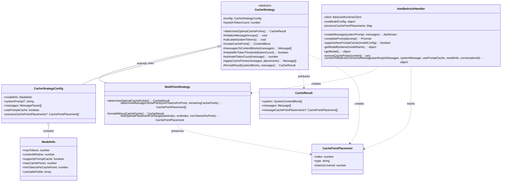
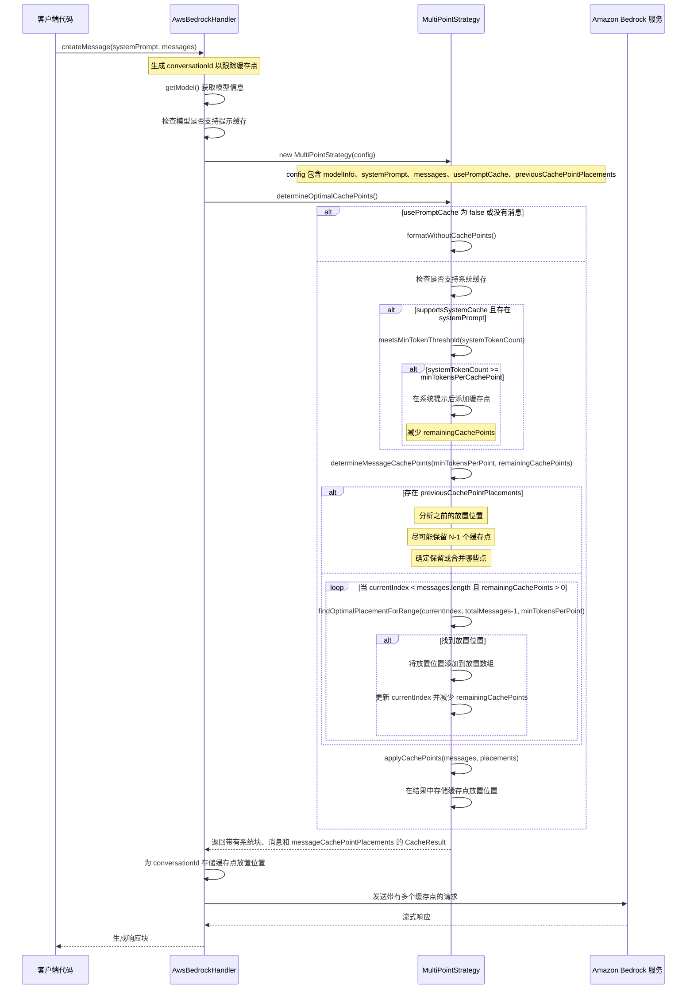

# 缓存策略文档

本文档提供了 Roo-Code 项目中 Amazon Bedrock 缓存策略实现的概述，包括类关系和时序图。

## 类关系图



## 时序图：多点策略

此图说明了在消息中使用具有多个缓存点的 MultiPointStrategy 时的流程。



## 关键概念

### 缓存策略

缓存策略系统设计用于优化 Amazon Bedrock API 请求中缓存点的放置。缓存点允许服务重用提示的先前处理部分，减少 token 使用并改善响应时间。

- **MultiPointStrategy**：在 Bedrock 缓存的第一个 MR 中，此策略用于所有缓存点放置场景。它在整个对话中分配缓存点以最大化缓存效率，无论模型支持一个还是多个缓存点。

### MultiPointStrategy 放置逻辑

- **系统提示缓存**：如果系统提示足够大（超过 minTokensPerCachePoint），则在其后放置缓存点。

- **消息缓存**：该策略使用简化方法在消息中放置缓存点：

    1. 对于新对话（没有先前的缓存点）：

        - 它在每个范围内迭代查找最后一条用户消息
        - 它确保每个放置位置至少覆盖最小 token 阈值
        - 它继续直到所有可用缓存点都被使用或无法找到更多有效放置位置

    2. 对于增长的对话（具有先前的缓存点）：
        - 它尽可能保留先前的缓存点
        - 它分析现有缓存点之间的 token 分布
        - 它将新消息的 token 计数与现有缓存点之间的最小间隙进行比较
        - 只有当新消息的 token 数多于最小间隙时，才合并缓存点

在增长对话中保持连续消息的一致性是缓存点放置的主要挑战。当向对话添加新消息时，我们希望确保：

1. 尽可能重用先前消息中的缓存点以最大化缓存命中率
2. 为新消息最佳放置新缓存点

简化方法确保：

- 缓存点始终放置在用户消息之后，这是自然的对话边界
- 每个缓存点至少覆盖最小 token 阈值
- 在增长对话中，N-1 个缓存点尽可能保持在相同位置
- 仅在合理时合并缓存点（当收益大于成本时）
- 新消息仅在包含足够 token 以证明重新分配合理时才接收缓存点

本文档中的示例反映了这种优化实现。

### 与 Amazon Bedrock 集成

AwsBedrockHandler 类通过以下方式与缓存策略集成：

1. 确定模型是否支持提示缓存
2. 根据模型功能创建适当的策略
3. 应用策略以使用最佳缓存点格式化消息
4. 将格式化的请求发送到 Amazon Bedrock
5. 处理并返回响应

## 使用注意事项

- 仅当多个请求中重复使用相同内容时，缓存点才有效
- 最小 token 阈值确保仅在提供有意义的好处的位置放置缓存点
- 当可用时，系统提示缓存是优先考虑的，因为它通常在请求之间保持静态
- 消息缓存更复杂，取决于对话结构和 token 分布 

## 示例：多点策略缓存点放置

### 示例 1：初始缓存点放置

在此示例中，我们将演示 `determineMessageCachePoints` 方法如何在新对话中放置缓存点。

**输入配置：**

```javascript
const config = {
	modelInfo: {
		maxTokens: 4096,
		contextWindow: 200000,
		supportsPromptCache: true,
		maxCachePoints: 3,
		minTokensPerCachePoint: 100,
		cachableFields: ["system", "messages"],
	},
	systemPrompt: "You are a helpful assistant.", // 约 10 个 token
	messages: [
		{ role: "user", content: "Tell me about machine learning." }, // 约 50 个 token
		{ role: "assistant", content: "Machine learning is a field of study..." }, // 约 150 个 token
		{ role: "user", content: "What about deep learning?" }, // 约 40 个 token
		{ role: "assistant", content: "Deep learning is a subset of machine learning..." }, // 约 160 个 token
	],
	usePromptCache: true,
}
```

**执行过程：**

1. 首先，评估系统提示是否可缓存（10 个 token < minTokensPerCachePoint 值 100），因此不使用缓存点。
2. 调用 `determineMessageCachePoints` 方法，参数为 `minTokensPerPoint = 100` 和 `remainingCachePoints = 3`。
3. 由于没有之前的缓存点放置，它进入新对话的特殊情况。
4. 它调用 `findOptimalPlacementForRange` 方法处理整个消息范围。
5. 该方法找到范围内的最后一条用户消息（索引 2："What about deep learning?"）。
6. 它计算覆盖的总 token 数（240）并验证其是否超过最小阈值（100）。
7. 将此放置位置添加到放置数组并继续处理下一个范围。
8. 由于在此点之后没有更多能覆盖足够 token 的用户消息，不再放置更多缓存点。

**输出缓存点放置：**

```javascript
;[
	{
		index: 2, // 第二条用户消息后（What about deep learning?）
		type: "message",
		tokensCovered: 240, // 覆盖约 240 个 token（前 3 条消息）
	},
]
```

**结果消息结构：**

```
[用户]: Tell me about machine learning.
[助手]: Machine learning is a field of study...
[用户]: What about deep learning?
[缓存点]
[助手]: Deep learning is a subset of machine learning...
```

**注意**：算法在第二条用户消息（范围内的最后一条用户消息）后放置缓存点，因为这是最佳放置位置，累积的 token 数（240）超过了最小阈值（100）。 

### 示例 2：增加一次交互并保留缓存点

现在，让我们看看当我们向对话添加一对新的交互（用户-助手对）并使用缓存点保留逻辑时会发生什么：

**更新的输入配置与先前的缓存点：**

```javascript
const config = {
	// 与之前相同的 modelInfo 和 systemPrompt
	messages: [
		// 前 4 条消息...
		{ role: "user", content: "How do neural networks work?" }, // 约 50 个 token
		{ role: "assistant", content: "Neural networks are composed of layers of nodes..." }, // 约 180 个 token
	],
	usePromptCache: true,
	// 传递来自示例 1 的先前缓存点放置
	previousCachePointPlacements: [
		{
			index: 2, // 第二条用户消息后（What about deep learning?）
			type: "message",
			tokensCovered: 240,
		},
	],
}
```

**带有缓存点保留的示例 2 执行过程：**

1. 系统提示评估保持不变（不使用缓存点）。
2. 算法检测到配置中提供了 `previousCachePointPlacements`。
3. 它分析先前的缓存点放置和当前的消息结构。
4. 由于我们总共有 3 个可用的缓存点，并且在先前的对话中使用了 1 个，我们可以保留先前的缓存点，并仍有 2 个用于新消息。
5. 算法保留来自先前对话的缓存点：
    - 索引 2 处的缓存点（"What about deep learning?" 之后）
6. 然后它根据新消息计算剩余缓存点的最佳放置。
7. 由于有 2 个带有大量 token 计数的新消息（230 个 token），它在新的用户消息后放置第二个缓存点。

**带有保留的输出缓存点放置：**

```javascript
;[
	{
		index: 2, // 第二条用户消息后（What about deep learning?）- 已保留
		type: "message",
		tokensCovered: 240, // 覆盖约 240 个 token（前 3 条消息）
	},
	{
		index: 4, // 第三条用户消息后（How do neural networks work?）- 新放置
		type: "message",
		tokensCovered: 230, // 覆盖约 230 个 token（缓存点之间的消息）
	},
]
```

**带有保留的结果消息结构：**

```
[用户]: Tell me about machine learning.
[助手]: Machine learning is a field of study...
[用户]: What about deep learning?
[缓存点 1] - 从之前保留
[助手]: Deep learning is a subset of machine learning...
[用户]: How do neural networks work?
[缓存点 2] - 新放置
[助手]: Neural networks are composed of layers of nodes...
```

**注意**：算法保留了先前对话中的缓存点，并为新消息放置了新的缓存点。这确保了最大的缓存命中率，同时仍然适应增长的对话。 

### 示例 3：再增加一次交互并保留缓存点

让我们再添加一次交互，看看缓存策略如何继续适应：

**更新的输入配置与先前的缓存点：**

```javascript
const config = {
	// 与之前相同的 modelInfo 和 systemPrompt
	messages: [
		// 前 6 条消息...
		{ role: "user", content: "Can you explain backpropagation?" }, // 约 40 个 token
		{ role: "assistant", content: "Backpropagation is an algorithm used to train neural networks..." }, // 约 170 个 token
	],
	usePromptCache: true,
	// 传递来自示例 2 的先前缓存点放置
	previousCachePointPlacements: [
		{
			index: 2, // 第二条用户消息后（What about deep learning?）
			type: "message",
			tokensCovered: 240,
		},
		{
			index: 4, // 第三条用户消息后（How do neural networks work?）
			type: "message",
			tokensCovered: 230,
		},
	],
}
```

**带有缓存点保留的示例 3 执行过程：**

1. 系统提示评估保持不变（不使用缓存点）。
2. 算法检测到配置中提供了 `previousCachePointPlacements`。
3. 它分析先前的缓存点放置和当前的消息结构。
4. 遵循 N-1 保留规则，它决定保留先前的两个缓存点（索引 2 和 4），因为总共有 3 个可用缓存点。
5. 然后它根据新消息计算剩余缓存点的最佳放置。
6. 由于有 2 个带有大量 token 计数的新消息（210 个 token），它在新的用户消息后放置新缓存点。

**带有保留的输出缓存点放置：**

```javascript
;[
	{
		index: 2, // 第二条用户消息后（What about deep learning?）- 已保留
		type: "message",
		tokensCovered: 240, // 覆盖约 240 个 token（前 3 条消息）
	},
	{
		index: 4, // 第三条用户消息后（How do neural networks work?）- 已保留
		type: "message",
		tokensCovered: 230, // 覆盖约 230 个 token（缓存点之间的消息）
	},
	{
		index: 6, // 第四条用户消息后（Can you explain backpropagation?）- 新放置
		type: "message",
		tokensCovered: 210, // 覆盖约 210 个 token（缓存点之间的消息）
	},
]
```

**带有保留的结果消息结构：**

```
[用户]: Tell me about machine learning.
[助手]: Machine learning is a field of study...
[用户]: What about deep learning?
[缓存点 1] - 从之前保留
[助手]: Deep learning is a subset of machine learning...
[用户]: How do neural networks work?
[缓存点 2] - 从之前保留
[助手]: Neural networks are composed of layers of nodes...
[用户]: Can you explain backpropagation?
[缓存点 3] - 新放置
[助手]: Backpropagation is an algorithm used to train neural networks...
```

**注意**：算法保留了先前对话中的两个缓存点，并为新消息放置了新的缓存点。这确保了最大的缓存命中率，同时仍然适应增长的对话。 

### 示例 4：添加消息（使用 Token 比较）

在此示例中，我们将演示当新消息的 token 计数较小，不应更改缓存点时算法如何处理：

**更新的输入配置与先前的缓存点：**

```javascript
const config = {
	// 与之前相同的 modelInfo 和 systemPrompt
	messages: [
		// 前 10 条消息...
		{
			role: "user",
			content: "Can you explain the difference between supervised and unsupervised learning in detail?",
		}, // 约 80 个 token
		{
			role: "assistant",
			content:
				"Certainly! Supervised learning and unsupervised learning are two fundamental paradigms in machine learning with..",
		}, // 约 130 个 token
	],
	usePromptCache: true,
	// 传递来自示例 3 的先前缓存点放置
	previousCachePointPlacements: [
		{
			index: 2, // 第二条用户消息后
			type: "message",
			tokensCovered: 240,
		},
		{
			index: 6, // 第四条用户消息后
			type: "message",
			tokensCovered: 440,
		},
		{
			index: 8, // 第五条用户消息后
			type: "message",
			tokensCovered: 260,
		},
	],
}
```

**带有 Token 比较的示例 4 执行过程：**

1. 算法检测到所有缓存点均已使用，并且已添加新消息。
2. 它计算新消息的 token 计数（210 个 token）。
3. 它分析现有缓存点之间的 token 分布，并找到最小间隙（260 个 token）。
4. 它比较新消息的 token 计数（210）与最小间隙（260）。
5. 由于新消息的 token 数少于最小间隙（210 < 260），它决定不重新分配缓存点。
6. 保留所有现有缓存点，不为新消息分配缓存点。

**输出缓存点放置（未更改）：**

```javascript
;[
	{
		index: 2, // 第二条用户消息后 - 已保留
		type: "message",
		tokensCovered: 240,
	},
	{
		index: 6, // 第四条用户消息后 - 已保留
		type: "message",
		tokensCovered: 440,
	},
	{
		index: 8, // 第五条用户消息后 - 已保留
		type: "message",
		tokensCovered: 260,
	},
]
```

**结果消息结构：**

```
[用户]: Tell me about machine learning.
[助手]: Machine learning is a field of study...
[用户]: What about deep learning?
[缓存点 1] - 已保留
[助手]: Deep learning is a subset of machine learning...
[用户]: How do neural networks work?
[助手]: Neural networks are composed of layers of nodes...
[用户]: Can you explain backpropagation?
[缓存点 2] - 已保留
[助手]: Backpropagation is an algorithm used to train neural networks...
[用户]: Can you explain the difference between supervised and unsupervised learning in detail?
[助手]: Certainly! Supervised learning and unsupervised learning are two fundamental paradigms in machine learning with...
```

**注意**：在这种情况下，算法确定与现有缓存点相比，新消息是消息历史中最小的部分。重组缓存点为新消息腾出空间将产生负面影响，因为它无法使用 2 个先前缓存的块，必须将这 2 个作为单个缓存点重写，并将写入一个新的小缓存点，而在下一轮消息中该小缓存点将被选择合并。 

### 示例 5：添加重新分配缓存点的消息

现在让我们看看当我们添加 token 计数较大的消息时会发生什么：

**更新的输入配置与先前的缓存点：**

```javascript
const config = {
	// 与之前相同的 modelInfo 和 systemPrompt
	messages: [
		// 前 10 条消息...
		{
			role: "user",
			content: "Can you provide a detailed example of implementing a neural network for image classification?",
		}, // 约 100 个 token
		{
			role: "assistant",
			content:
				"Certainly! Here's a detailed example of implementing a convolutional neural network (CNN) for image classification using TensorFlow and Keras...",
		}, // 约 300 个 token
	],
	usePromptCache: true,
	// 传递来自示例 3 的先前缓存点放置
	previousCachePointPlacements: [
		{
			index: 2, // 第二条用户消息后
			type: "message",
			tokensCovered: 240,
		},
		{
			index: 6, // 第四条用户消息后
			type: "message",
			tokensCovered: 440,
		},
		{
			index: 8, // 第五条用户消息后
			type: "message",
			tokensCovered: 260,
		},
	],
}
```

**带有 Token 比较的示例 5 执行过程：**

1. 算法检测到所有缓存点均已使用，并且已添加新消息。
2. 它计算新消息的 token 计数（400 个 token）。
3. 它分析现有缓存点之间的 token 分布，并找到最小间隙（260 个 token）。
4. 它通过应用 20% 的增加来计算所需的 token 阈值（260 * 1.2 = 312）。
5. 它比较新消息的 token 计数（400）与此阈值（312）。
6. 由于新消息的 token 数显著多于阈值（400 > 312），它决定合并缓存点。
7. 它识别索引 8 处的缓存点具有最小的 token 覆盖范围（260 个 token）。
8. 它移除此缓存点，并在新用户消息后放置一个新的缓存点。

**带有重新分配的输出缓存点放置：**

```javascript
;[
	{
		index: 2, // 第二条用户消息后 - 已保留
		type: "message",
		tokensCovered: 240,
	},
	{
		index: 6, // 第四条用户消息后 - 已保留
		type: "message",
		tokensCovered: 440,
	},
	{
		index: 10, // 第六条用户消息后 - 新放置
		type: "message",
		tokensCovered: 660, // 第 7 至 10 条消息的 token（260 + 400）
	},
]
```

**结果消息结构：**

```
[用户]: Tell me about machine learning.
[助手]: Machine learning is a field of study...
[用户]: What about deep learning?
[缓存点 1] - 已保留
[助手]: Deep learning is a subset of machine learning...
[用户]: How do neural networks work?
[助手]: Neural networks are composed of layers of nodes...
[用户]: Can you explain backpropagation?
[缓存点 2] - 已保留
[助手]: Backpropagation is an algorithm used to train neural networks...
[用户]: What are some applications of deep learning?
[助手]: Deep learning has many applications including...
[用户]: Can you provide a detailed example of implementing a neural network for image classification?
[缓存点 3] - 新放置
[助手]: Certainly! Here's a detailed example of implementing a convolutional neural network (CNN) for image classification using TensorFlow and Keras...
```

**注意**：在这种情况下，算法确定对新消息重新分配缓存点是有益的，因为它们包含比现有缓存点之间的最小间隙更多的 token。这种优化确保对话中最占用 token 的部分被缓存。

**重要**：每个缓存点的 `tokensCovered` 值表示从上一个缓存点（或对于第一个缓存点来说是对话开始）到当前缓存点的总 token 数。例如，索引 10 处的缓存点覆盖 660 个 token，包括第 7 至 10 条消息的所有 token（从索引 6 处的缓存点之后到索引 10 处的缓存点，包括该缓存点）。

### 关键观察

1. **简单的初始放置逻辑**：范围内满足最小 token 阈值的最后一条用户消息设置为缓存点。

2. **用户消息边界要求**：缓存点专门放置在用户消息之后，而不是助手消息之后。这确保缓存点放置在用户提供输入的自然对话边界处。

3. **Token 阈值强制执行**：缓存点之间的每个段必须满足最小 token 阈值（在我们的示例中为 100 个 token）才能考虑缓存。通过检查放置位置覆盖的总 token 是否满足最小阈值的保护条件强制执行此要求。

4. **增长对话的自适应放置**：随着对话的增长，该策略适应性地在可能的情况下保留先前的缓存点，并仅在有益时重新分配它们。

5. **带有所需增加的 Token 比较优化**：当所有缓存点都被使用并添加新消息时，算法将新消息的 token 计数与相邻现有缓存点的最小组合 token 计数进行比较，应用所需的百分比增加（20%）以确保重新分配是值得的。只有当新消息的 token 显著多于此阈值时才合并缓存点，确保只有在对缓存效率产生实质性净正面影响时才进行重新分配。

这种自适应方法确保随着对话的增长，缓存策略通过战略性地在最有效的位置放置缓存点继续优化 token 使用和响应时间，同时避免可能对缓存性能产生净负面影响的低效重新分配。 