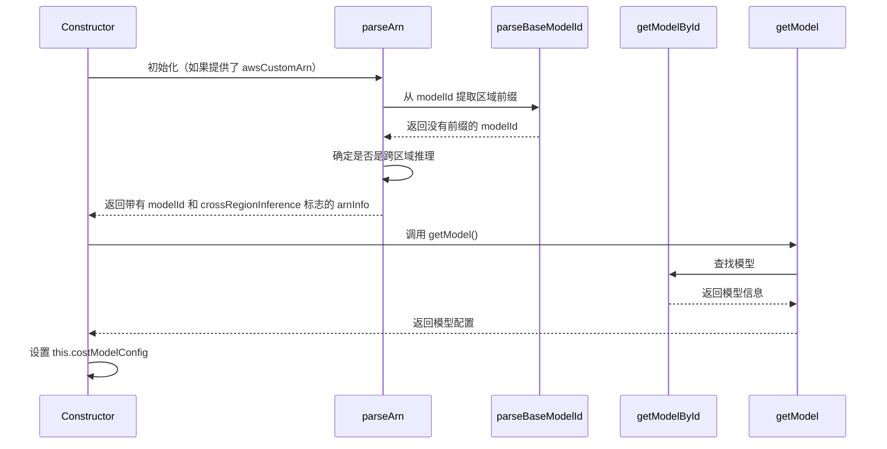
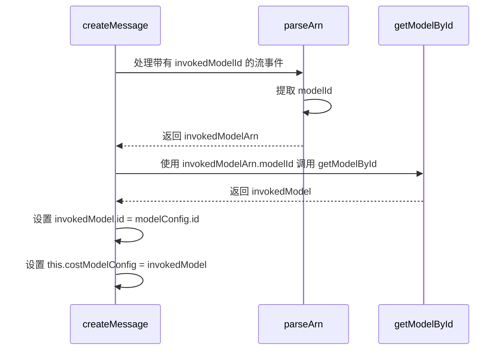

# Bedrock 模型识别

本文档解释了 Amazon Bedrock 提供商实现（`bedrock.ts`）中如何识别和管理模型信息。它重点关注确定 `costModelConfig` 属性的操作序列，该属性对于 token 计数、定价和其他功能至关重要。

## 模型识别流程

`costModelConfig` 属性通过不同路径设置，具体取决于输入配置和来自 Bedrock 的响应数据。以下是模型识别工作方式的时序图：



### 流处理期间（使用提示路由器）



## 输入示例和结果值

### 示例 1：标准模型选择

**输入：**

```javascript
const handler = new AwsBedrockHandler({
	apiModelId: "anthropic.claude-3-5-sonnet-20241022-v2:0",
	awsAccessKey: "ACCESS_KEY",
	awsSecretKey: "SECRET_KEY",
	awsRegion: "us-east-1",
})
```

**序列：**

1. 构造函数使用选项初始化
2. 构造函数调用 `getModel()`
3. `getModel()` 调用 `getModelById("anthropic.claude-3-5-sonnet-20241022-v2:0")`
4. `getModelById()` 在 `bedrockModels` 中查找模型
5. `this.costModelConfig` 设置为：
   ```javascript
   {
     id: "anthropic.claude-3-5-sonnet-20241022-v2:0",
     info: {
       maxTokens: 4096,
       contextWindow: 128000,
       inputPrice: 3,
       outputPrice: 15,
       // 其他模型属性...
     }
   }
   ```

### 示例 2：基础模型的自定义 ARN

**输入：**

```javascript
const handler = new AwsBedrockHandler({
	apiModelId: "anthropic.claude-3-5-sonnet-20241022-v2:0",
	awsAccessKey: "ACCESS_KEY",
	awsSecretKey: "SECRET_KEY",
	awsRegion: "us-east-1",
	awsCustomArn: "arn:aws:bedrock:us-east-1::foundation-model/anthropic.claude-3-5-sonnet-20241022-v2:0",
})
```

**序列：**

1. 构造函数使用选项初始化
2. 构造函数调用 `parseArn("arn:aws:bedrock:us-east-1::foundation-model/anthropic.claude-3-5-sonnet-20241022-v2:0")`
3. `parseArn()` 提取：
   ```javascript
   {
     isValid: true,
     region: "us-east-1",
     modelType: "foundation-model",
     modelId: "anthropic.claude-3-5-sonnet-20241022-v2:0",
     crossRegionInference: false
   }
   ```
4. 构造函数将 `this.arnInfo` 设置为结果
5. 构造函数调用 `getModel()`
6. `getModel()` 调用 `getModelById("anthropic.claude-3-5-sonnet-20241022-v2:0")`
7. `getModelById()` 在 `bedrockModels` 中查找模型
8. `this.costModelConfig` 设置为：
   ```javascript
   {
     id: "anthropic.claude-3-5-sonnet-20241022-v2:0", // 注意：ID 不是 ARN，因为它是基础模型
     info: {
       maxTokens: 4096,
       contextWindow: 128000,
       inputPrice: 3,
       outputPrice: 15,
       // 其他模型属性...
     }
   }
   ```

### 示例 3：提示路由器的自定义 ARN

**输入：**

```javascript
const handler = new AwsBedrockHandler({
	apiModelId: "anthropic.claude-3-5-sonnet-20241022-v2:0",
	awsAccessKey: "ACCESS_KEY",
	awsSecretKey: "SECRET_KEY",
	awsRegion: "us-west-2",
	awsCustomArn: "arn:aws:bedrock:us-west-2:123456789012:prompt-router/my-router",
})
```

**序列：**

1. 构造函数使用选项初始化
2. 构造函数调用 `parseArn("arn:aws:bedrock:us-west-2:123456789012:prompt-router/my-router")`
3. `parseArn()` 提取：
   ```javascript
   {
     isValid: true,
     region: "us-west-2",
     modelType: "prompt-router",
     modelId: "my-router",
     crossRegionInference: false
   }
   ```
4. 构造函数将 `this.arnInfo` 设置为结果
5. 构造函数调用 `getModel()`
6. `getModel()` 调用 `getModelById("my-router")`
7. `getModelById()` 在 `bedrockModels` 中找不到 "my-router"，返回默认模型信息
8. 由于 `this.arnInfo.modelType` 是 "prompt-router"（不是 "foundation-model"），`getModel()` 将 ID 设置为完整 ARN
9. `this.costModelConfig` 设置为：
   ```javascript
   {
     id: "arn:aws:bedrock:us-west-2:123456789012:prompt-router/my-router", // 完整 ARN 作为 ID
     info: {
       // 提示路由器的默认模型信息
       maxTokens: 4096,
       contextWindow: 128000,
       inputPrice: 3,
       outputPrice: 15,
       // 其他模型属性...
     }
   }
   ```

### 示例 4：跨区域推理

**输入：**

```javascript
const handler = new AwsBedrockHandler({
	apiModelId: "anthropic.claude-3-5-sonnet-20241022-v2:0",
	awsAccessKey: "ACCESS_KEY",
	awsSecretKey: "SECRET_KEY",
	awsRegion: "eu-west-1",
	awsUseCrossRegionInference: true,
})
```

**序列：**

1. 构造函数使用选项初始化
2. 构造函数调用 `getModel()`
3. `getModel()` 调用 `getModelById("anthropic.claude-3-5-sonnet-20241022-v2:0")`
4. `getModelById()` 在 `bedrockModels` 中查找模型
5. 由于 `awsUseCrossRegionInference` 为 true，`getModel()` 获取 "eu-west-1" 的前缀（即 "eu."）
6. `getModel()` 在模型 ID 前添加 "eu."
7. `this.costModelConfig` 设置为：
   ```javascript
   {
     id: "eu.anthropic.claude-3-5-sonnet-20241022-v2:0", // 注意 "eu." 前缀
     info: {
       maxTokens: 4096,
       contextWindow: 128000,
       inputPrice: 3,
       outputPrice: 15,
       // 其他模型属性...
     }
   }
   ```

### 示例 5：带有 invokedModelId 流的提示路由器

**初始输入：**

```javascript
const handler = new AwsBedrockHandler({
	awsAccessKey: "ACCESS_KEY",
	awsSecretKey: "SECRET_KEY",
	awsRegion: "us-west-2",
	awsCustomArn: "arn:aws:bedrock:us-west-2:123456789012:prompt-router/my-router",
})
```

**初始序列（与示例 3 相同）：**

1. `this.costModelConfig` 最初设置为：
   ```javascript
   {
     id: "arn:aws:bedrock:us-west-2:123456789012:prompt-router/my-router",
     info: {
       // 提示路由器的默认模型信息
       maxTokens: 4096,
       contextWindow: 128000,
       inputPrice: 3,
       outputPrice: 15,
       // 其他属性...
     }
   }
   ```

**带有 invokedModelId 的流事件：**

```javascript
{
  trace: {
    promptRouter: {
      invokedModelId: "arn:aws:bedrock:us-west-2:123456789012:inference-profile/anthropic.claude-3-5-sonnet-20241022-v2:0",
      usage: {
        inputTokens: 150,
        outputTokens: 250
      }
    }
  }
}
```

**流处理序列：**

1. `createMessage()` 遇到带有 `invokedModelId` 的流事件
2. 它调用 `parseArn("arn:aws:bedrock:us-west-2:123456789012:inference-profile/anthropic.claude-3-5-sonnet-20241022-v2:0")`
3. `parseArn()` 提取：
   ```javascript
   {
     isValid: true,
     region: "us-west-2",
     modelType: "inference-profile",
     modelId: "anthropic.claude-3-5-sonnet-20241022-v2:0",
     crossRegionInference: false
   }
   ```
4. `createMessage()` 调用 `getModelById("anthropic.claude-3-5-sonnet-20241022-v2:0")`
5. `getModelById()` 在 `bedrockModels` 中查找模型并返回模型信息
6. `createMessage()` 将 `invokedModel.id` 设置为原始路由器 ID
7. `this.costModelConfig` 更新为：
   ```javascript
   {
     id: "arn:aws:bedrock:us-west-2:123456789012:prompt-router/my-router", // 保持路由器 ID
     info: {
       // Claude 3.5 Sonnet 模型信息
       maxTokens: 4096,
       contextWindow: 128000,
       inputPrice: 3,
       outputPrice: 15,
       // 其他 Claude 特定属性...
     }
   }
   ```

这确保了：

1. 后续请求继续使用提示路由器
2. Token 计数和定价使用实际模型的费率
3. 上下文窗口和其他模型特定属性正确设置

### 示例 6：带区域前缀的跨区域 ARN

**输入：**

```javascript
const handler = new AwsBedrockHandler({
	apiModelId: "anthropic.claude-3-5-sonnet-20241022-v2:0",
	awsAccessKey: "ACCESS_KEY",
	awsSecretKey: "SECRET_KEY",
	awsRegion: "us-east-1",
	awsCustomArn:
		"arn:aws:bedrock:us-west-2:123456789012:inference-profile/us.anthropic.claude-3-5-sonnet-20241022-v2:0",
})
```

**序列：**

1. 构造函数使用选项初始化
2. 构造函数调用 `parseArn("arn:aws:bedrock:us-west-2:123456789012:inference-profile/us.anthropic.claude-3-5-sonnet-20241022-v2:0")`
3. `parseArn()` 提取区域并调用 `parseBaseModelId("us.anthropic.claude-3-5-sonnet-20241022-v2:0")`
4. `parseBaseModelId()` 识别 "us." 作为区域前缀并将其移除
5. `parseArn()` 返回：
   ```javascript
   {
     isValid: true,
     region: "us-west-2",
     modelType: "inference-profile",
     modelId: "anthropic.claude-3-5-sonnet-20241022-v2:0", // 注意：前缀已移除
     crossRegionInference: true // 检测到跨区域
   }
   ```
6. 构造函数将 `this.arnInfo` 设置为结果并将 `this.options.awsRegion` 更新为 "us-west-2"
7. 构造函数调用 `getModel()`
8. `getModel()` 调用 `getModelById("anthropic.claude-3-5-sonnet-20241022-v2:0")`
9. `getModelById()` 在 `bedrockModels` 中查找模型
10. 由于 `this.arnInfo.modelType` 是 "inference-profile"（不是 "foundation-model"），`getModel()` 将 ID 设置为完整 ARN
11. `this.costModelConfig` 设置为：
    ```javascript
    {
      id: "arn:aws:bedrock:us-west-2:123456789012:inference-profile/us.anthropic.claude-3-5-sonnet-20241022-v2:0", // 完整 ARN
      info: {
        maxTokens: 4096,
        contextWindow: 128000,
        inputPrice: 3,
        outputPrice: 15,
        // 其他模型属性...
      }
    }
    ```

### 示例 7：带区域前缀的单区域 ARN (apne3)

**输入：**

```javascript
const handler = new AwsBedrockHandler({
	apiModelId: "anthropic.claude-3-5-sonnet-20241022-v2:0",
	awsAccessKey: "ACCESS_KEY",
	awsSecretKey: "SECRET_KEY",
	awsRegion: "ap-northeast-3", // 大阪区域
	awsCustomArn:
		"arn:aws:bedrock:ap-northeast-3:123456789012:inference-profile/apne3.anthropic.claude-3-5-sonnet-20241022-v2:0",
})
```

**序列：**

1. 构造函数使用选项初始化
2. 构造函数调用 `parseArn("arn:aws:bedrock:ap-northeast-3:123456789012:inference-profile/apne3.anthropic.claude-3-5-sonnet-20241022-v2:0")`
3. `parseArn()` 提取区域并调用 `parseBaseModelId("apne3.anthropic.claude-3-5-sonnet-20241022-v2:0")`
4. `parseBaseModelId()` 识别 "apne3." 作为区域前缀并将其移除
5. `parseArn()` 返回：
   ```javascript
   {
     isValid: true,
     region: "ap-northeast-3",
     modelType: "inference-profile",
     modelId: "anthropic.claude-3-5-sonnet-20241022-v2:0", // 注意：前缀已移除
     crossRegionInference: false // 不是跨区域前缀，因为 apne3 映射到单个区域
   }
   ```
6. 构造函数将 `this.arnInfo` 设置为结果
7. 构造函数调用 `getModel()`
8. `getModel()` 调用 `getModelById("anthropic.claude-3-5-sonnet-20241022-v2:0")`
9. `getModelById()` 在 `bedrockModels` 中查找模型
10. 由于 `this.arnInfo.modelType` 是 "inference-profile"（不是 "foundation-model"），`getModel()` 将 ID 设置为完整 ARN
11. `this.costModelConfig` 设置为：
    ```javascript
    {
      id: "arn:aws:bedrock:ap-northeast-3:123456789012:inference-profile/apne3.anthropic.claude-3-5-sonnet-20241022-v2:0", // 完整 ARN
      info: {
        maxTokens: 4096,
        contextWindow: 128000,
        inputPrice: 3,
        outputPrice: 15,
        // 其他模型属性...
      }
    }
    ```

## 区域前缀

系统识别以下用于跨区域推理的区域前缀：

| 前缀     | 区域 ID          | 描述                     | 多区域   |
| -------- | ---------------- | ------------------------- | ------------ |
| "us."    | "us-east-1"      | 美国东部（弗吉尼亚北部） | 是          |
| "use1."  | "us-east-1"      | 美国东部（弗吉尼亚北部） | 否           |
| "use2."  | "us-east-2"      | 美国东部（俄亥俄）      | 否           |
| "usw2."  | "us-west-2"      | 美国西部（俄勒冈）      | 否           |
| "eu."    | "eu-west-1"      | 欧洲（爱尔兰）          | 是          |
| "euw1."  | "eu-west-1"      | 欧洲（爱尔兰）          | 否           |
| "ap."    | "ap-southeast-1" | 亚太地区（新加坡）      | 是          |
| "apne1." | "ap-northeast-1" | 亚太地区（东京）        | 否           |
| "apne3." | "ap-northeast-3" | 亚太地区（大阪）        | 否           |
| "ca."    | "ca-central-1"   | 加拿大（中部）          | 是          |
| "sa."    | "sa-east-1"      | 南美洲（圣保罗）        | 是          |
| "apac."  | "ap-southeast-1" | 默认亚太地区            | 是          |
| "emea."  | "eu-west-1"      | 默认欧洲、中东和非洲地区 | 是          |
| "amer."  | "us-east-1"      | 默认美洲地区            | 是          |

这些前缀用于：

1. 在 `parseBaseModelId()` 中识别并剥离模型 ID 中的区域前缀
2. 在启用跨区域推理时在 `getModel()` 中添加适当的区域前缀

**关于多区域前缀的说明：**

- 标记为"多区域"的前缀（如 "us."、"eu."、"ap." 等）在 ARN 中检测到时将 `crossRegionInference` 标志设置为 `true`
- 这些前缀通常代表具有多个 AWS 区域的地理区域
- 单区域前缀（如 "apne3."、"use1." 等）将 `crossRegionInference` 标志设置为 `false`
- `crossRegionInference` 标志影响系统处理区域特定模型配置的方式

## 总结

Bedrock 提供商的模型识别系统遵循以下关键原则：

1. **ARN 解析**：从 ARN 中提取模型 ID、区域和资源类型
2. **模型查找**：使用提取的模型 ID 查找模型信息
3. **ID 保留**：
    - 对于基础模型：直接使用模型 ID
    - 对于其他资源（提示路由器、推理配置文件）：使用完整 ARN 作为 ID
4. **跨区域处理**：根据需要添加或移除区域前缀
5. **动态更新**：当提示路由器提供 invokedModelId 时更新模型信息

该系统确保：

- API 请求使用正确的模型 ID
- Token 计数和定价使用准确的模型信息
- 跨区域推理正常工作
- 提示路由器可以动态选择模型，同时保持适当的跟踪
``` 